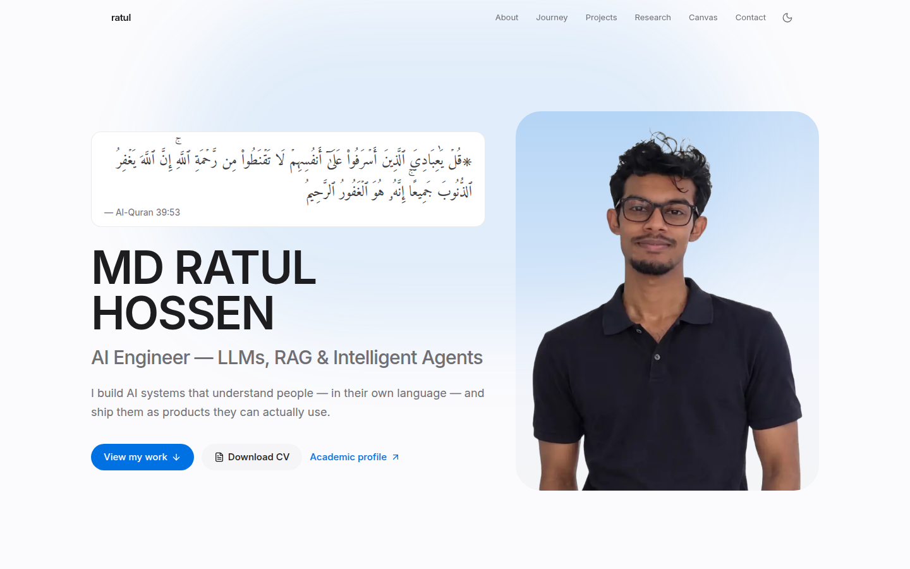
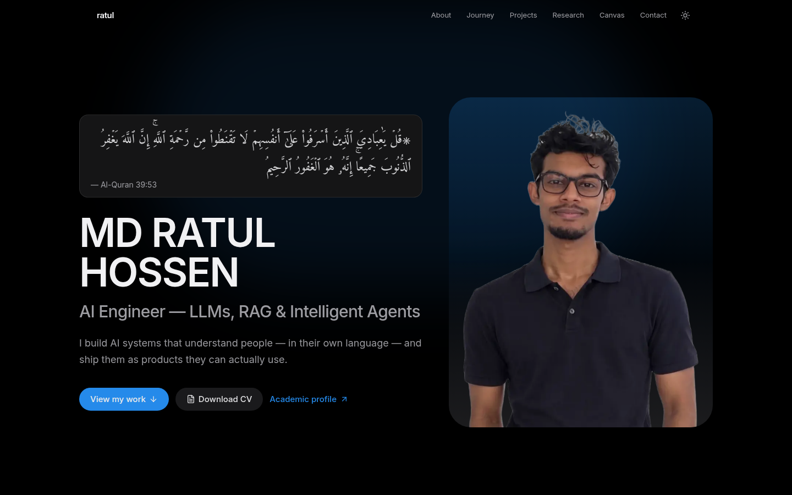
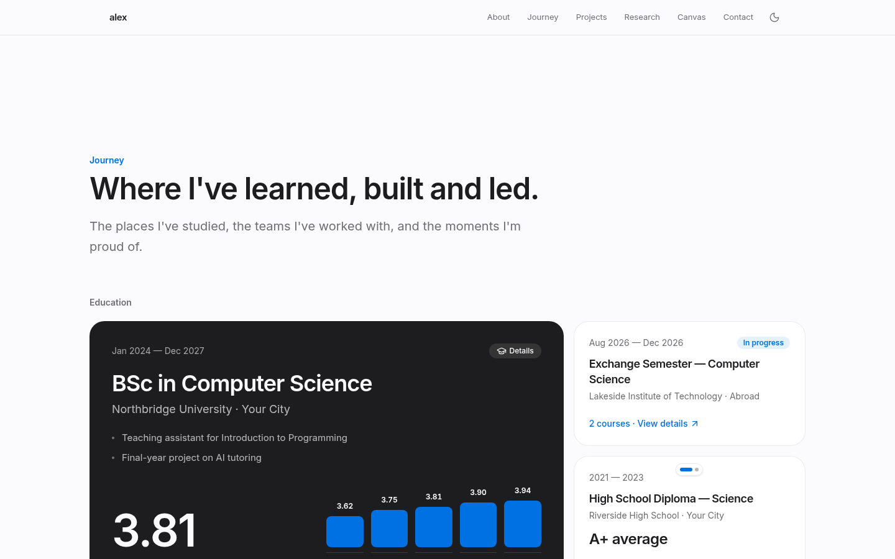
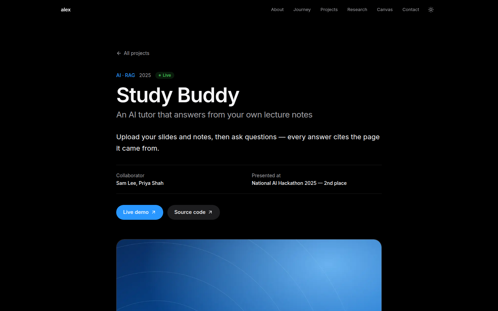
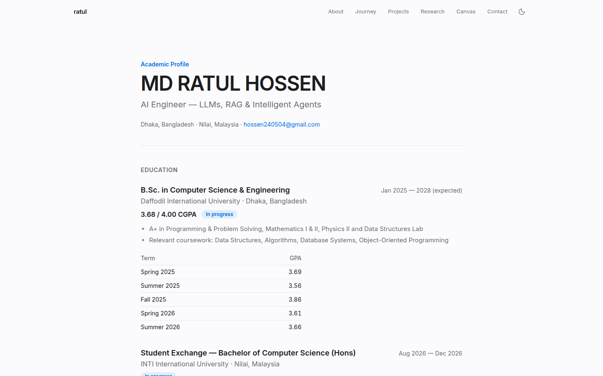
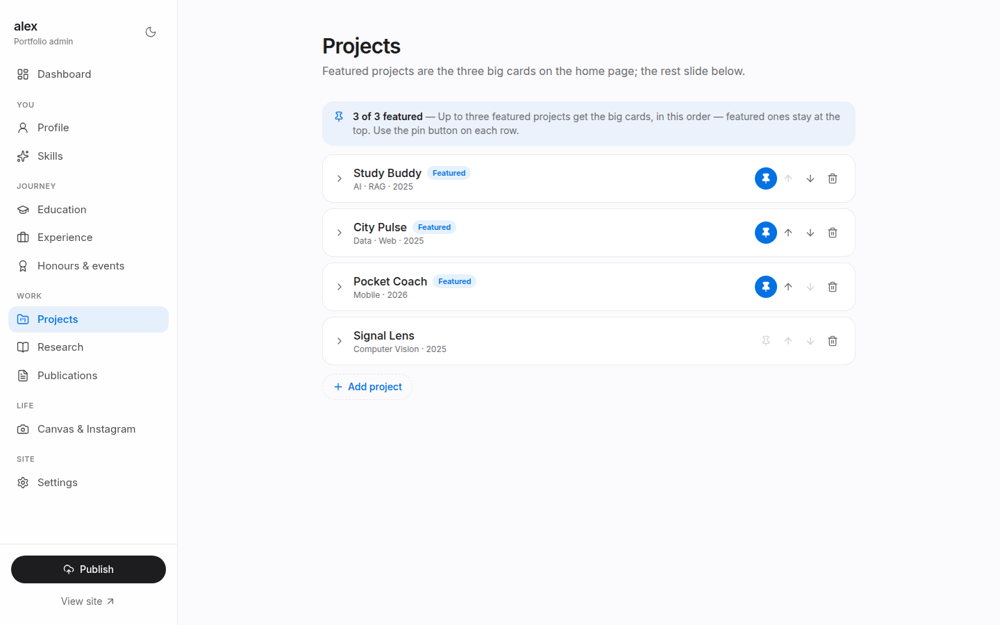
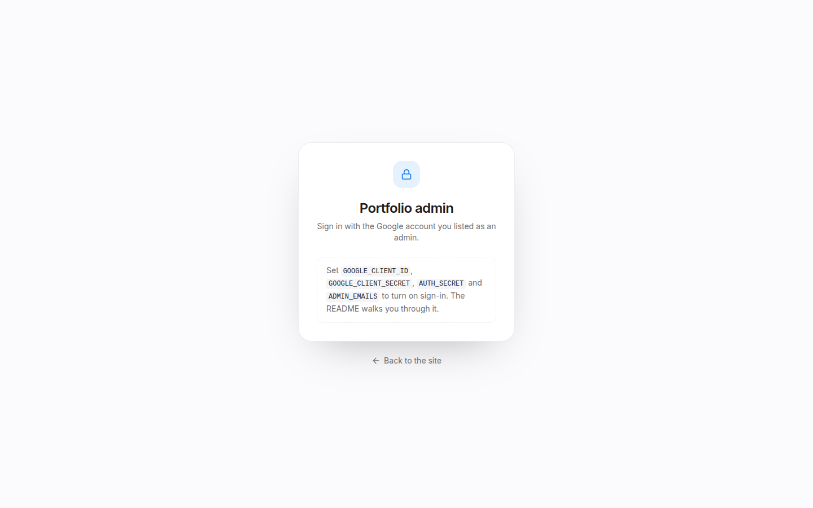

<div align="center">

# Portfolio

**A personal portfolio site with its own admin panel. Clone it, sign in with Google, fill in your story, and it's live in an afternoon.**

Next.js 16 · TypeScript · Tailwind CSS v4 · Auth.js · Neon Postgres · Vercel Blob · free hosting on Vercel

### 🌐 Live example: **[ratul.world](https://ratul.world)**

[](https://ratul.world)


&nbsp;
[](https://vercel.com/new/clone?repository-url=https%3A%2F%2Fgithub.com%2Fratul-hossen%2Fportfolio&project-name=portfolio&repository-name=portfolio)

<a href="https://ratul.world"></a>

<sub>Screenshots are from <a href="https://ratul.world">ratul.world</a>, the site this template was built for. The repo itself ships with demo content that you replace with your own.</sub>

</div>

<table>
  <tr>
    <td width="50%"></td>
    <td width="50%"></td>
  </tr>
  <tr>
    <td></td>
    <td></td>
  </tr>
  <tr>
    <td></td>
    <td></td>
  </tr>
</table>

---

## Contents

1. [Features](#features)
2. [How it works](#how-it-works)
3. [Quick start (on your computer)](#1-quick-start-on-your-computer)
4. [Make it yours](#2-make-it-yours)
5. [Put it online with Vercel](#3-put-it-online-with-vercel)
6. [Admin login with Google](#4-admin-login-with-google)
7. [Edit from anywhere (Neon database + Vercel Blob)](#5-edit-from-anywhere-neon-database--vercel-blob)
8. [Your own domain](#6-your-own-domain-optional)
9. [Environment variables](#environment-variables)
10. [Project structure](#project-structure)
11. [Troubleshooting](#troubleshooting)
12. [Getting updates from this template](#getting-updates-from-this-template)
13. [বাংলায় সংক্ষেপে](#বাংলায়-সংক্ষেপে)
14. [Contributors](#contributors)

---

## Features

**The site**

- **Hero** with your photo (or several that rotate), headline, status line, and a CV download button
- **About** with a "global journey" timeline and the languages you speak
- **Journey**: education as a collage with a **GPA trend chart** and course lists, experience & leadership, plus a carousel of honours, talks and events
- **Skills** as a bento-style collage
- **Projects** with full **case-study pages** (problem → approach → impact → tech)
- **Research** statement, interests and **publication pages**
- **Canvas** for life outside work: interests, Instagram embeds and a photo gallery
- **Academic profile** at `/academic`, a calm one-page CV for university applications
- **Light & dark theme**, smooth scroll animations (switched off for people who prefer reduced motion), fully responsive
- **SEO built in**: page titles, Open Graph previews, JSON-LD, `sitemap.xml`, `robots.txt`

**The admin panel** (`/admin`)

- Edit **every section** with forms. No code and no JSON.
- **Upload** photos, PDFs and videos. Photos are resized and converted to WebP automatically.
- Reorder and pin items, preview collages live, and press <kbd>⌘</kbd>/<kbd>Ctrl</kbd>+<kbd>S</kbd> to save
- **Show or hide any section** and rewrite every heading and menu label under **Settings**
- **Google sign-in** (Auth.js): only the email addresses you list can get in. A Microsoft / Office 365 login can be added too.
- **Saves go live instantly**: content lives in a free **Neon** Postgres database, uploads on **Vercel Blob**
- **Version history**: every save keeps the previous version, and any of them can be restored in one click
- **Works without a database, too**: on your computer everything is saved to one JSON file, and Publish pushes it to GitHub

## How it works

```
  you ──► /admin ──► Sign in with Google ──► Save
          (only emails in ADMIN_EMAILS)        │
                                               ├──► Neon Postgres ── your content (+ every earlier version)
                                               └──► Vercel Blob ──── your photos, PDFs and videos
                                                        │
                            the site reads them ◄───────┘   → live within seconds, no redeploy
```

| Where you edit | Content is saved to | How it goes live |
| --- | --- | --- |
| **Live site** (`yoursite.com/admin`) | Neon database + Vercel Blob | Instantly, on Save |
| **Your computer** (`npm run dev`, no database) | `src/content/site.json` + `public/uploads/` | Press **Publish**. It does a git push, and Vercel redeploys. |

The file `src/content/site.json` also **seeds** the database: until your first save on the live site, the site shows what's in that file.

---

## 1. Quick start (on your computer)

You need **[Node.js 22](https://nodejs.org)** (or newer) and **[Git](https://git-scm.com)**.

**a) Get your own copy of the repo.** [**Sign in to GitHub**](https://github.com/login) first — the button only appears when you're signed in. Then, at the top of this page, click the green **Use this template** button (left of **Code**, above the file list) → **Create a new repository**. On a phone, open the page in *desktop mode*. Or use [**this direct link**](https://github.com/new?template_name=portfolio&template_owner=ratul-hossen), or **Fork**. Name it `portfolio`. GitHub now has a copy that belongs to **you**, at `https://github.com/YOUR-GITHUB-USERNAME/portfolio`.

> [!IMPORTANT]
> Wherever this guide says **`YOUR-GITHUB-USERNAME`**, type **your own** GitHub username.
> For example, if your profile is `github.com/jane-doe`, the command below becomes
> `git clone https://github.com/jane-doe/portfolio.git`.
> Clone **your copy**, not this repo. The admin panel's Publish button pushes to the repo you cloned.

```bash
git clone https://github.com/YOUR-GITHUB-USERNAME/portfolio.git
```

```bash
cd portfolio
```

**b) Install and run:**

```bash
npm install
```

```bash
npm run dev
```

Open **http://localhost:3000** to see the demo site, and **http://localhost:3000/admin** for the admin panel.
On your own computer the admin panel opens **without a login** until you set up Google (step 4).

## 2. Make it yours

Open **http://localhost:3000/admin** and go through the sidebar from top to bottom:

| Admin page | What to fill in |
| --- | --- |
| **Profile** | Name, headline, tagline, photo, CV (PDF), email, About paragraphs, languages, social links (the demo links say `your-username`, so put in your real GitHub, LinkedIn and Instagram) |
| **Skills** | Groups of skills. The first box is the big one. |
| **Education** | Degrees and schools. Add term GPAs (with credits) and the CGPA and chart are calculated for you. |
| **Experience** | Jobs, internships and leadership roles |
| **Honours & events** | Awards, hackathons and talks. Pinned ones come first. |
| **Projects** | Each project gets its own page at `/projects/<slug>`. Pin up to three as featured. |
| **Research / Publications** | Your research statement, interests and papers (each gets a page) |
| **Canvas & Instagram** | Hobbies, Instagram post links, and a photo gallery |
| **Settings** | Turn sections on or off, rewrite every heading, choose menu labels, enable `/academic` |

Every **Save** updates the page at `localhost:3000` right away. When you're happy, press **Publish** (bottom-left). It commits your changes and pushes them to GitHub.

> [!TIP]
> Delete the demo images in `public/demo/` once you've replaced them all with your own photos.

**Optional tweaks in code**

- **Colours**: edit the tokens at the top of [`src/app/globals.css`](src/app/globals.css). Change `--accent` to recolour the whole site.
- **Font**: swap `Inter` in [`src/app/layout.tsx`](src/app/layout.tsx) for any [Google Font](https://fonts.google.com).
- **Favicon**: replace [`src/app/favicon.ico`](src/app/favicon.ico).
- **Content by hand**: everything lives in [`src/content/site.json`](src/content/site.json), and the shape is documented in [`src/content/types.ts`](src/content/types.ts).

## 3. Put it online with Vercel

[Vercel](https://vercel.com) hosts Next.js sites for free on the Hobby plan.

1. Push your repo to GitHub (the **Publish** button does it, or `git push`).
2. Go to **[vercel.com/new](https://vercel.com/new)** and sign in with GitHub.
3. **Import** your `portfolio` repository. Vercel detects Next.js, so leave every setting as it is.
4. Click **Deploy**. About a minute later your site is live at `https://YOUR-PROJECT.vercel.app`.
   (`YOUR-PROJECT` is the name Vercel shows on the success screen, e.g. `jane-portfolio.vercel.app`. The steps below use it.)

From now on, **every push to `main` redeploys the site automatically.**

> [!TIP]
> **In a hurry? Use the "Deploy with Vercel" button** at the top of this page instead of steps 1–4.
> It creates **your own copy** of this repo in your GitHub account and deploys it in one go.
> Two things to know:
> - It deploys the **demo content**. Replace it from the admin panel once steps 4 and 5 are done.
> - It does **not** set up the login, database or uploads. That's what steps 4 and 5 are for (about 10 minutes).

> At this point the public site works, and `/admin` on the live site asks you to sign in. The next two steps turn that on.

## 4. Admin login with Google

This takes about 5 minutes and is free.

### 4.1 Create a Google OAuth client

1. Open the **[Google Cloud Console](https://console.cloud.google.com/)** and create a project (top bar → project picker → **New project**, name it e.g. `portfolio`).
2. Go to **APIs & Services → OAuth consent screen** (called **Google Auth Platform** in newer consoles) and click **Get started**:
   - **App name**: `Portfolio admin`, **User support email**: your email
   - **Audience**: **External**
   - **Contact email**: your email → **Create**
3. Under **Audience → Test users**, click **Add users** and add **your Gmail address**.
   (Or click **Publish app**. With only the basic profile and email scopes, Google doesn't need to review it.)
4. Go to **Clients** (or **Credentials → Create credentials → OAuth client ID**):
   - **Application type**: **Web application**
   - **Name**: `Portfolio`
   - **Authorized redirect URIs**, add **both** of these:
     ```
     http://localhost:3000/api/auth/callback/google
     https://YOUR-PROJECT.vercel.app/api/auth/callback/google
     ```
     (Add your custom domain too later, e.g. `https://yourname.com/api/auth/callback/google`.)
5. Click **Create** and copy the **Client ID** and **Client secret**.

### 4.2 Generate a secret

This random string signs your login cookie. Run either of these:

```bash
npx auth secret
```

```bash
openssl rand -base64 33
```

Any long random string (40+ characters) works too, e.g. from a password generator.

### 4.3 Add the variables to Vercel

In Vercel, open your project → **Settings → Environment Variables** and add:

| Name | Value |
| --- | --- |
| `AUTH_GOOGLE_ID` | the Client ID from 4.1 |
| `AUTH_GOOGLE_SECRET` | the Client secret from 4.1 |
| `AUTH_SECRET` | the random string from 4.2 |
| `ADMIN_EMAILS` | your Gmail address. For several people, separate with commas: `me@gmail.com,friend@gmail.com` |

Then **Deployments → ⋯ on the latest → Redeploy** so the new variables take effect.

Visit `https://YOUR-PROJECT.vercel.app/admin`, click **Continue with Google**, and you're in. 🎉
The panel says **Read-only** until you do step 5.

<details>
<summary><b>Optional: also allow a Microsoft / Office 365 account</b> (e.g. a university email)</summary>

1. In the **[Microsoft Entra admin center](https://entra.microsoft.com/)** → **App registrations → New registration**.
2. **Supported account types**: *Accounts in any organizational directory and personal Microsoft accounts*.
3. **Redirect URI** (Web): `https://YOUR-PROJECT.vercel.app/api/auth/callback/microsoft-entra-id`
4. Copy the **Application (client) ID**, then under **Certificates & secrets** create a **client secret**.
5. Add to Vercel: `AUTH_MICROSOFT_ENTRA_ID_ID`, `AUTH_MICROSOFT_ENTRA_ID_SECRET` and
   `AUTH_MICROSOFT_ENTRA_ID_ISSUER=https://login.microsoftonline.com/common/v2.0`. Add that email to `ADMIN_EMAILS` too, then Redeploy.

A **Continue with Microsoft** button then appears on the sign-in page.
</details>

**To require the login on your computer too**, copy the example file, fill in the same values, and set `ADMIN_REQUIRE_LOGIN=true`:

```bash
cp .env.example .env.local
```

## 5. Edit from anywhere (Neon database + Vercel Blob)

The live site needs somewhere to keep your edits and uploads. Both have free plans and are **one click each inside Vercel**. Vercel adds the environment variables for you.

**5.1 Database (Neon)**: stores your content and its version history.

1. Vercel → your project → **Storage** tab → **Create Database** → choose **Neon** (Serverless Postgres) → **Continue**.
2. Pick the **Free** plan and a region close to you → **Create**.
3. When asked, **connect it to your project** (all environments). This adds `DATABASE_URL`.

**5.2 File storage (Vercel Blob)**: stores the photos, PDFs and videos you upload.

1. Same **Storage** tab → **Create Database** → **Blob** → **Create**.
2. Connect it to your project. This adds `BLOB_READ_WRITE_TOKEN`.

**5.3 Redeploy**: **Deployments → ⋯ → Redeploy**.

Now, on the live site:

- **Save** writes to the database, and the change is **live within seconds**. There's no Publish step.
- **Uploads** go straight from your browser to Blob. Photos are resized to WebP first. There's no small size limit (up to 100 MB per file).
- **Version history** on the admin dashboard lists earlier saves. **Restore** brings one back.
- The tables are created automatically the first time. Until your first save, the site shows the content from `src/content/site.json`.

> [!IMPORTANT]
> Once the database is connected, **the database is the source of truth**. Editing `site.json` and pushing it no longer changes the live site. Make your edits in `/admin`.

## 6. Your own domain (optional)

1. Buy a domain from any registrar (Namecheap, Cloudflare, Porkbun…).
2. Vercel → your project → **Settings → Domains → Add** and follow the DNS instructions.
3. Add the domain's callback to your Google OAuth client (step 4.1.4):
   `https://yourname.com/api/auth/callback/google`
4. Add `NEXT_PUBLIC_SITE_URL=https://yourname.com` in Vercel so link previews and the sitemap use it, then **Redeploy**.

---

## Environment variables

All of them are optional for `npm run dev`. See [`.env.example`](.env.example).

| Variable | Needed for | Description |
| --- | --- | --- |
| `AUTH_SECRET` | Admin login | Long random string that signs the session cookie |
| `AUTH_GOOGLE_ID` | Admin login | OAuth client ID from Google Cloud |
| `AUTH_GOOGLE_SECRET` | Admin login | OAuth client secret |
| `ADMIN_EMAILS` | Admin login | Comma-separated accounts allowed into `/admin` |
| `DATABASE_URL` | Editing on the live site | Neon connection string. **Added automatically** when you connect Neon in Vercel. |
| `BLOB_READ_WRITE_TOKEN` | Uploads on the live site | **Added automatically** when you connect Blob in Vercel |
| `AUTH_MICROSOFT_ENTRA_ID_ID` / `_SECRET` / `_ISSUER` | Optional Microsoft login | See the collapsible section in step 4 |
| `ADMIN_REQUIRE_LOGIN` | Optional | `true` requires the login on your own computer too |
| `NEXT_PUBLIC_SITE_URL` | Custom domain | Public URL for the sitemap and previews. Defaults to your Vercel domain. |

## Project structure

```
src/
├─ auth.ts                 ← Auth.js setup: Google (+ optional Microsoft), ADMIN_EMAILS check
├─ content/
│  ├─ site.json            ← starting content (and all content when there's no database)
│  └─ types.ts             ← the shape of that content, with comments
├─ app/
│  ├─ (site)/              ← public pages: home, /academic, /projects/[slug], /research/[slug]
│  ├─ admin/               ← the admin panel (forms are defined in _editor/schema.ts)
│  ├─ api/auth/            ← Auth.js sign-in / callback routes
│  └─ login/               ← the sign-in page
├─ components/
│  ├─ sections/            ← Hero, About, Journey, Skills, Projects, Research, Canvas, Contact
│  ├─ site/                ← navbar, footer, theme toggle
│  └─ ui/                  ← buttons, carousels, media rotator, charts…
└─ lib/
   ├─ admin.ts             ← "who is the signed-in admin?" (open on your own computer)
   ├─ store.ts             ← reads/writes content: Neon database, or the JSON file
   └─ content.ts           ← the read API every page uses
public/
├─ uploads/                ← local uploads (when Blob isn't connected)
└─ demo/                   ← demo images (delete once replaced)
```

**Adding a field** to a section takes two small edits: add it to the type in `src/content/types.ts`, then add one line to the section's form in `src/app/admin/_editor/schema.ts`. The editor renders forms from that schema automatically.

**Security in short:** `/admin`, every save and restore action and the upload endpoints all check the session. Sign-in goes through Auth.js, and only verified emails listed in `ADMIN_EMAILS` get a session (a signed, HTTP-only cookie). The database and Blob keys only ever live on the server.

## Scripts

```bash
npm run dev     # local site + admin at http://localhost:3000
npm run build   # production build (what Vercel runs)
npm run start   # serve the production build locally
npm run lint    # ESLint
```

## Troubleshooting

<details>
<summary><b>Google says <code>Error 400: redirect_uri_mismatch</code></b></summary>

The address you're signing in from isn't in **Authorized redirect URIs** (step 4.1.4). It must match exactly: `https://`, no trailing slash, ending in `/api/auth/callback/google`. Changes can take a few minutes to apply.
</details>

<details>
<summary><b>"That account isn't on the admin list"</b></summary>

Add the exact email to `ADMIN_EMAILS` in Vercel (comma-separated, no quotes) and **Redeploy**.
</details>

<details>
<summary><b>"Sign-in isn't set up correctly" (Configuration error)</b></summary>

`AUTH_SECRET`, `AUTH_GOOGLE_ID` or `AUTH_GOOGLE_SECRET` is missing or mistyped in Vercel. Check the names exactly as in step 4.3, then **Redeploy**.
</details>

<details>
<summary><b>Google says "Access blocked: app has not completed the verification process"</b></summary>

Your OAuth app is in **Testing** mode and your email isn't a test user. Add it under **Audience → Test users**, or click **Publish app**.
</details>

<details>
<summary><b>The admin panel says "Read-only", or Save is greyed out</b></summary>

The database isn't connected yet, or you haven't redeployed since connecting it (step 5). Check that `DATABASE_URL` is listed under **Settings → Environment Variables**.
</details>

<details>
<summary><b>Upload fails with "Uploads need Vercel Blob to be connected"</b></summary>

Connect Blob (step 5.2) and **Redeploy**. Check that `BLOB_READ_WRITE_TOKEN` is listed under **Settings → Environment Variables**.
</details>

<details>
<summary><b>I edited <code>site.json</code> and pushed, but the live site didn't change</b></summary>

With a database connected, the site reads from the database, not the file. Make the change in `/admin` instead.
</details>

<details>
<summary><b>I saved something by mistake</b></summary>

Open the admin **Dashboard → Version history** and **Restore** the version from before the mistake. The current version is kept in history too.
</details>

<details>
<summary><b>Publish fails on my computer with a git error</b></summary>

Publish runs `git add`, `git commit`, `git pull` and `git push` for you, so your folder must be a clone of your GitHub repo and you must be able to `git push` from a terminal. Run `git push` once by hand to see the real error.
</details>

## Getting updates from this template

Want improvements made here after you copied it? Add this repo as a second remote and merge:

```bash
git remote add upstream https://github.com/ratul-hossen/portfolio.git
```

```bash
git pull upstream main --allow-unrelated-histories
```

With the database connected, your content lives there, so updates never touch it. If git reports a conflict in `src/content/site.json`, keep **your** version.

---

## বাংলায় সংক্ষেপে

1. উপরে **Use this template** চাপ দিয়ে নিজের GitHub-এ একটা কপি বানাও, তারপর সেটা clone করো।
2. `npm install`, তারপর `npm run dev`। এরপর **localhost:3000/admin** খুলে নিজের সব তথ্য বসাও এবং **Publish** চাপো।
3. **[vercel.com/new](https://vercel.com/new)**-এ গিয়ে রিপোটা Import করে **Deploy** দাও। তোমার সাইট লাইভ হয়ে যাবে।
4. **Google লগইন**: Google Cloud Console-এ একটা OAuth Client (Web application) বানাও, redirect URI দাও `https://<তোমার-সাইট>/api/auth/callback/google`। তারপর Vercel-এ `AUTH_GOOGLE_ID`, `AUTH_GOOGLE_SECRET`, `AUTH_SECRET` আর `ADMIN_EMAILS` সেট করে Redeploy দাও (ধাপ ৪ দেখো)।
5. **লাইভ সাইট থেকে এডিট**: Vercel-এ প্রজেক্টের **Storage** ট্যাব থেকে **Neon** (database) আর **Blob** (ফাইল রাখার জায়গা) যোগ করো। দুটোই ফ্রি, আর environment variable নিজে থেকেই বসে যায়। তারপর Redeploy দাও (ধাপ ৫ দেখো)। এরপর থেকে Save চাপলেই সাথে সাথে সাইটে দেখাবে, আর ভুল হলে Dashboard-এর **Version history** থেকে আগের version ফেরত আনা যাবে।

কোনো সমস্যা হলে উপরের **Troubleshooting** অংশটা দেখো, অথবা একটা Issue খোলো।

---

## Contributors

<table>
  <tr>
    <td align="center">
      <a href="https://www.instagram.com/_hossen_ratul/">
        <br>
        <b>MD Ratul Hossen</b>
      </a><br>
      <sub>Creator & maintainer</sub><br>
      <a href="https://ratul.world">🌐 ratul.world</a> · <a href="https://github.com/ratul-hossen">GitHub</a>
    </td>
  </tr>
</table>

Pull requests are welcome. Found a bug or have an idea? [Open an issue](https://github.com/ratul-hossen/portfolio/issues).

## License

[MIT](LICENSE). Use it for your own portfolio and change anything you like. A ⭐ on the repo is appreciated if it helped you.

Made with ❤️ by **[MD Ratul Hossen](https://ratul.world)**. See it live at **[ratul.world](https://ratul.world)**.
